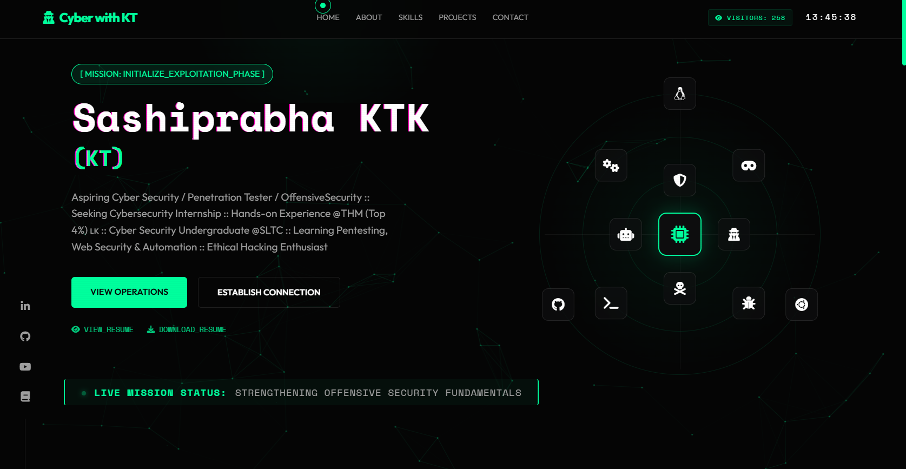

# <p align="center">🛡️ Cyber with KT | Professional Cybersecurity Portfolio </p>

<p align="center">
  
  
  
</p>

<p align="center">
  <a href="https://tryhackme.com/p/SashiprabhaKTK"></a>
  <a href="https://app.hackthebox.com/profile/sashiprabhaktk"></a>
  <a href="https://linkedin.com/in/sashiprabhaktk"></a>
</p>

---

## 🌐 Live Access
**Explore the interactive experience here:** 
### 👉 [sashiprabhaktk.github.io/Cyber_with_KT/](https://sashiprabhaktk.github.io/Cyber_with_KT/)

---

## 📌 Table of Contents
- [🚀 Overview](#overview)
- [✨ Key Features](#key-features)
- [💻 Tech Stack](#tech-stack)
- [📂 Featured Projects](#featured-projects)
- [⚙️ How to Run Locally](#how-to-run-locally)
- [📁 Folder Structure](#folder-structure)
- [🤝 Connect](#connect)

---

<a id="overview"></a>
## 🚀 Overview

Welcome to my official professional portfolio. This is not just a static webpage; it's a **cybersecurity-themed immersive experience** designed to showcase my journey, technical prowess, and passion for **Offensive Security**. 

Built with a focus on modern UI/UX principles, it simulates a high-tech terminal interface reflecting the tools and environments used by security professionals.



---

<a id="key-features"></a>
## ✨ Key Features

### ⚔️ Offensive Security Aesthetics
*   **Encrypted Text Decryption:** Hover animations that simulate real-time data deciphering on section titles.
*   **Terminal Simulation:** An interactive "WhoAmI" terminal prompt and a live-typing mission status bar.
*   **Neural Background:** Interactive particle canvas reacting to mouse movements, representing distributed network nodes.

### 📡 Interactive UX
*   **Capabilities Radar:** A dynamic orbital radar displaying my core security toolset.
*   **Encapsulated Resume Viewer:** view my professional resume without leaving the site using a high-tech modal interface.
*   **Animated Statistics:** Real-time counters showing progress across THM, HTB, and professional certifications.

---

<a id="tech-stack"></a>
## 💻 Tech Stack

| Technology | Purpose |
| :--- | :--- |
| **Vite** | Modern, ultra-fast build tool and development server |
| **HTML5 / CSS3** | Semantic structure and advanced vanilla animations |
| **JavaScript (ES6+)** | Core logic, interactivity, and Terminal simulations |
| **Canvas API** | Dynamic background and complex geometric animations |
| **Web3Forms** | Secure, backend-less contact form handling |
| **Font Awesome** | Industrial standard icon set for technical tools |

---

<a id="featured-projects"></a>
## 📂 Featured Projects

### ⚔️ [Cyber_with_KT](https://github.com/sashiprabhaktk/Cyber_with_KT)
*Professional cybersecurity-themed immersive portfolio.*
- **Focus:** Modern UI/UX with Offensive Security aesthetics.
- **Key Feature:** Dynamic terminal simulations, orbital capabilities radar, and interactive vulnerability metrics.

### 🛡️ [SecuriScanX](https://github.com/sashiprabhaktk/SecuriScanX)
*A Chrome extension for real-time vulnerability detection.*
- **Focus:** SQLi, XSS, and CMDi detection.
- **Key Feature:** Smart result tags and automated Excel reporting for rapid security assessment.

### 🐚 [SwiftShell](https://github.com/sashiprabhaktk/SwiftShell)
*All-in-one Linux security automation tool.*
- **Focus:** Rapid terminal environment setup.
- **Key Feature:** Automates user creation and configures modern Zsh/Powerlevel10k environments for security researchers.

---

<a id="how-to-run-locally"></a>
## ⚙️ How to Run Locally

Get the development environment up and running in minutes:

1.  **Clone the Repository**
    ```bash
    git clone https://github.com/sashiprabhaktk/Cyber_with_KT.git
    cd Cyber_with_KT
    ```

2.  **Install Dependencies**
    ```bash
    npm install
    ```

3.  **Launch Development Server**
    ```bash
    npm run dev
    ```
4.  **Access:** Open `http://localhost:5173` in your browser.

---

<a id="folder-structure"></a>
## 📁 Folder Structure

```text
├── index.html          # Main architecture
├── package.json        # Manifest & Commands
├── vite.config.js      # Build configuration
├── public/
│   └── Resources/      # Compiled Assets (Certs, Badges, Media)
├── src/                
│   ├── main.js         # Interactive Logic & Animation Engine
│   └── style.css       # The "Cyber" Visual System
└── README.md           # Documentation
```

---

<a id="connect"></a>
## 🤝 Connect with Me

<p align="left">
<a href="https://linkedin.com/in/sashiprabhaktk"></a> 
<a href="https://github.com/sashiprabhaktk"></a>
<a href="https://youtube.com/@CyberWithKT"></a>
<a href="https://tryhackme.com/p/SashiprabhaKTK"></a>
</p>

---

## 📜 License
This project is for educational and demonstrative purposes. Identity elements and personal data are private property. You are welcome to explore the code for inspiration.

## ⚠️ Legal Disclaimer
Information provided is for **educational and ethical purposes only**. Developing security tools requires responsibility. Always obtain proper authorization before testing any system.

**[ STATUS: MISSION ACTIVE ]** // Built with ⚔️ by Sashiprabha KTK (KT)

